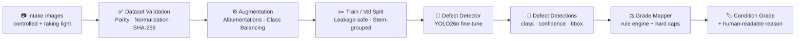

# 📷 Camera & Lens — Cosmetic Quality Control Pipeline

A **computer-vision pipeline** that detects **cosmetic and optical defects** on used
cameras and lenses, then maps those detections to a **marketplace-style condition
grade** (`Like New` → `Heavily Used`). Built on **YOLO26n (Ultralytics)**.


> **Status: scaffold.** The taxonomy, dataset config, grading logic, and docs are
> defined and the grading engine runs today. The **dataset has not yet been
> collected and the detector has not yet been trained** — this repo is the
> engineering frame you drop a labeled camera/lens dataset into.

---

## 🚀 Why this project

Used-camera marketplaces live and die on **condition grading**. A buyer paying
four figures for a used lens needs to trust that "Excellent" means the same thing
on every listing. Today that grading is done by trained human inspectors — slow,
subjective at the margins, and hard to scale across thousands of intake units.

This project explores the **decision-support half** of that problem: can a vision
model *pre-screen* incoming gear, flag the defects it can see, and propose a grade
for a human to confirm or override? The goal is not to replace the grader — it's
to make every grader faster and more consistent, and to make the grade
**auditable** (every grade comes with a reason).

It splits cleanly into two layers:

1. **Perception** — a YOLO detector that finds and classifies defects in a photo.
2. **Policy** — a transparent rule engine ([`src/grade_mapper.py`](src/grade_mapper.py))
   that turns detected defects into a condition grade you can read the reasoning for.

---

## 🏗️ Pipeline architecture



The first four phases are inherited from the source bottle-QC scaffold (and are
domain-agnostic). The new work is the **defect taxonomy**, the **grade mapper**,
and the dataset that has to be built for this domain.

---

## 📊 Defect taxonomy

Ten classes, split by what the defect *affects* (see [`camera_lens.yaml`](camera_lens.yaml)):

| ID | Class | Family | Description |
|---|---|---|---|
| 0 | `pristine` | — | No visible cosmetic or optical defect |
| 1 | `body_scratch` | Cosmetic | Scratches / scuffs on body, barrel, filter ring |
| 2 | `paint_wear` | Cosmetic | Brassing / paint loss, usually on edges and mounts |
| 3 | `dent` | Cosmetic | Dents / dings on body, barrel, filter thread |
| 4 | `lens_scratch` | Optical | Scratch or mark on a front/rear glass element |
| 5 | `internal_dust` | Borderline | Dust specks inside the lens elements |
| 6 | `fungus` | Optical | Fungal growth (web/branch pattern) inside the lens |
| 7 | `haze` | Optical | Internal haze / cloudiness on elements |
| 8 | `coating_damage` | Optical | Coating scratches, marks, oil, cleaning marks |
| 9 | `screen_damage` | Cosmetic | Scratches / cracks on LCD or top display |

**Cosmetic** defects affect resale, not photos → penalized lightly. **Optical**
defects can degrade the actual images → penalized heavily, with hard grade caps.
**Borderline** (`internal_dust`) is normal in small amounts; only quantity matters.

---

## ⚖️ From defects to a grade

The grade mapper assigns one of five condition grades:

`Like New` · `Excellent` · `Good` · `Well Used` · `Heavily Used`

It scores each unit down from 100 using area-scaled per-class penalties, then
applies **optical-critical hard caps** (e.g. *any* fungus caps the grade at
`Well Used`, regardless of how clean it otherwise looks). Every grade comes with a
reason string. Full rules: [`docs/grading_rubric.md`](docs/grading_rubric.md).

Try it now (no model or data needed — runs on synthetic detections):

```bash
python src/grade_mapper.py
```

```
Scenario                      Score  Grade          Reason
------------------------------------------------------------------------------------------
Clean unit                    100.0  Like New       No defects above confidence threshold.
One small body scratch         92.0  Excellent      Defects: body_scratch(-8).
Worn but clean glass           79.0  Good           Defects: paint_wear(-9), paint_wear(-9), internal_dust(-3).
Large haze                     60.0  Well Used      Defects: haze(-40). Caps: large haze → Well Used cap.
Fungus, otherwise clean        84.0  Well Used      Defects: fungus(-16). Caps: fungus → Well Used cap.
Central scratch + dents         6.0  Heavily Used   Defects: lens_scratch(-45), dent(-28), dent(-21). ...
```

Wiring the detector into the mapper:

```python
from ultralytics import YOLO
from src.grade_mapper import grade_from_ultralytics

result = YOLO("runs/detect/train/weights/best.pt")("intake_lens.jpg")[0]
print(grade_from_ultralytics(result))   # -> GradeResult(grade=..., score=..., reason=...)
```

---

## 📁 Project structure

```
camera-lens-quality-control/
├── README.md                     ← You are here
├── camera_lens.yaml              ← YOLO dataset config (10 classes)
├── model_card.json               ← Model metadata + status
├── requirements.txt
├── src/
│   └── grade_mapper.py           ← Defect → condition-grade rule engine (runnable)
├── docs/
│   ├── grading_rubric.md         ← Detected-defect → grade policy (the PM piece)
│   ├── dataset_card.md           ← Capture + annotation methodology (template)
│   └── engineering_debrief.md    ← Inherited 6-bug post-mortem from the source pipeline
└── reference/
    └── Big_Cola_QualCtrl.ipynb   ← Original bottle pipeline, kept as a reference scaffold
```

---

## 🛠️ Requirements

```bash
pip install -r requirements.txt
```

The grade mapper itself has **no dependencies** — it's pure Python and runs on its
own. Ultralytics/Albumentations/OpenCV are only needed once you train the detector.

---

## 🗺️ Roadmap

- [x] Define defect taxonomy (10 classes) and dataset config
- [x] Build the grade-mapping rule engine + rubric
- [ ] Collect & annotate a camera/lens defect dataset (controlled + raking light)
- [ ] Adapt the inherited notebook pipeline to `camera_lens.yaml`
- [ ] Train baseline vs. augmented YOLO26n; record mAP
- [ ] Calibrate grade-mapper weights/caps against real graded inventory
- [ ] Validate proposed-grade vs. human-grade agreement (the metric that matters)

---

## 📌 Scope & honest limitations

- **Visual only.** Shutter count, autofocus accuracy, aperture actuation, and
  electronic faults are invisible to a camera and out of scope.
- **Optical defects are lighting-dependent.** Fungus, haze, and coating marks need
  raking or transmitted light to image reliably — capture protocol matters as much
  as the model.
- **The grading rubric is illustrative**, not an official marketplace standard, and
  must be calibrated before any operational use.
- This is a **harder** detection problem than the source bottle project: defects
  are small, low-contrast, and partly subjective.

---

## 🙏 Attribution

The pipeline scaffold (dataset validation gates, SHA-256 fingerprinting,
leakage-safe split, Albumentations augmentation, the 6-bug engineering debrief)
is adapted from the **Big Cola Bottle Quality Control** project by
**Youssef El Demerdash** — <https://github.com/Demerdashh/bigcola-bottles-quality-control>
(MIT-licensed). The camera/lens taxonomy, grading rubric, and grade-mapper engine
are new work in this repository.

*Adapted by Ali Mahmoud.*
